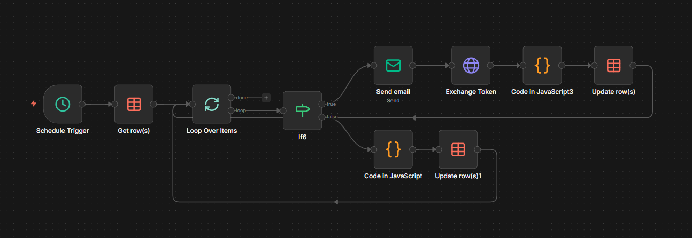
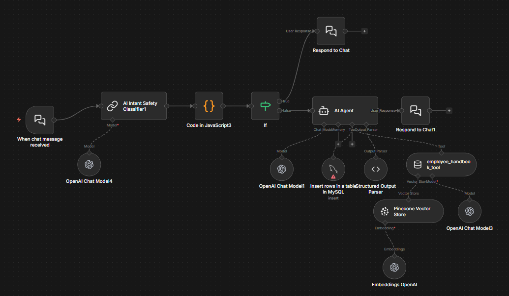
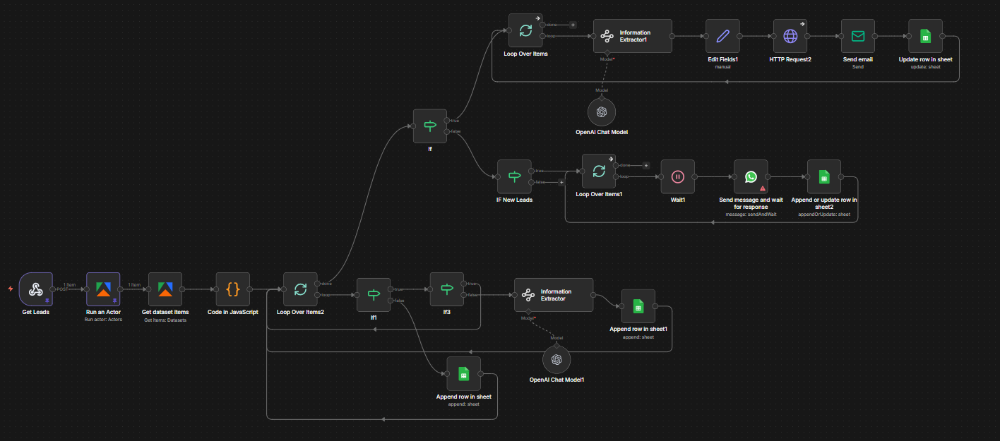
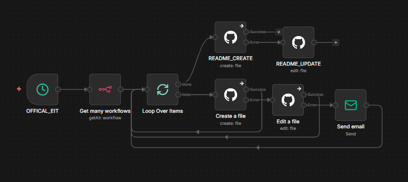
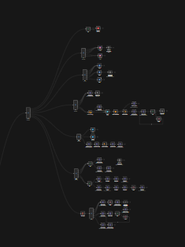
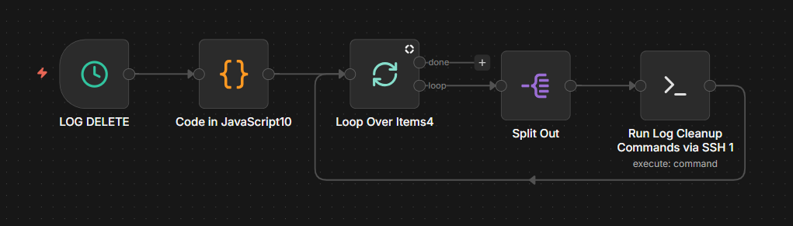
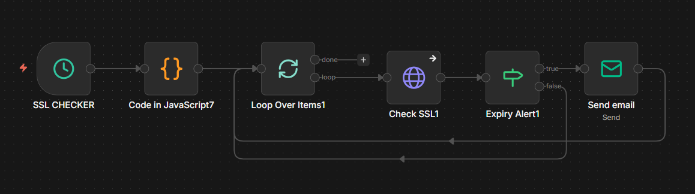
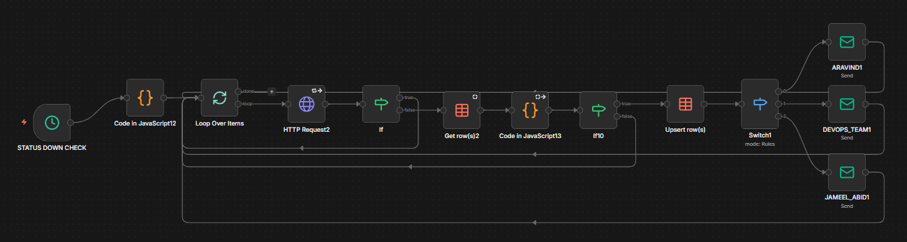

# Automation Portfolio — Mohamed - Automation Specialist

Automation Engineer specializing in workflow, integration, and AI automation.

## Projects

### AI EOD Reporting & Distribution Automation

Automated end-of-day (EOD) reporting workflow that aggregates task and opportunity data, generates structured AI summaries, and distributes reports across multiple channels.

**Key capabilities:**
- Scheduled trigger for automated daily execution
- Aggregates ClickUp tasks and GHL opportunities
- Data merging and transformation pipeline
- AI agent generates structured EOD summaries
- Multi-channel distribution (Slack, Email, Google Drive)
- Automated file conversion and cloud upload

**Tools & integrations:**  
n8n • Azure OpenAI • ClickUp • GoHighLevel (GHL) • Slack • Email • Google Drive  

**Outcome:**  
Eliminates manual reporting, ensures consistent daily updates, and delivers AI-generated insights automatically to stakeholders.

### Subscription Renewal Reminder & Tracking Automation

Automated workflow that monitors customer renewal dates, sends proactive reminders, alerts internal teams, and logs outcomes for tracking and reporting.

**Key capabilities:**
- Daily scheduled scan of GoHighLevel contacts
- Detects upcoming renewals within 10 days
- Filters contacts with renewal metadata
- Automated customer renewal email via Gmail
- Internal Slack alerts for team visibility
- Consolidates notification results
- Generates summary report
- Logs renewal activity to Google Sheets

**Outcome:**  
Prevents missed renewals, improves retention follow-ups, and provides a centralized renewal tracking log for operations teams.

### AI Lead Scoring & Automated Assignment Workflow

AI-powered lead qualification workflow that analyzes new CRM contacts, calculates engagement-based scores, and automatically assigns leads to the appropriate sales pipeline with notifications.

**Key capabilities:**
- Webhook trigger for new GoHighLevel contacts
- Retrieves contact and engagement history
- Data cleaning and AI input preparation
- GPT-based lead scoring model
- Converts AI score into numeric routing logic
- Segments leads into Hot, Warm, and Cold tiers
- Automatic tagging and owner assignment in CRM
- Slack alerts for high-priority (Hot) leads

**Scoring logic:**
- Score ≥ 80 → Hot lead → Assign to top sales rep + Slack alert  
- Score 40–79 → Warm lead → Assign to secondary rep  
- Score < 40 → Cold lead → Assign to nurture pipeline  

**Outcome:**  
Improves sales response time, prioritizes high-value prospects, and ensures consistent lead distribution without manual triage.

### Universal API Token Expiry Monitoring & Auto-Refresh Automation

Automated workflow that monitors stored API/OAuth tokens, detects upcoming expirations, refreshes tokens via exchange endpoints, and updates centralized records to maintain uninterrupted integrations.

**Key capabilities:**
- Scheduled scan of token registry (Google Sheets)
- Iterates through all stored API tokens
- Expiry validation and threshold check
- Conditional refresh logic
- OAuth token exchange via HTTP request
- JavaScript transformation of refresh response
- Automatic token update in registry
- Failure handling and status tracking

**Process logic:**
- Valid token → update last-checked timestamp  
- Expiring/expired token → refresh via API exchange  
- Store new access token + expiry metadata  

**Outcome:**  
Prevents integration downtime by ensuring all API tokens remain valid and centrally managed across automation systems.

### AI Knowledge Base Chatbot with Safety & RAG Retrieval

Intelligent chatbot workflow that classifies user intent, applies safety filtering, retrieves knowledge from a vector database, and generates contextual AI responses with structured logging.

**Key capabilities:**
- Chat trigger for incoming user messages
- AI intent classification and safety filtering
- Conditional routing for safe vs restricted queries
- RAG retrieval from Pinecone vector knowledge base
- AI agent response generation (OpenAI)
- Structured output parsing
- Conversation logging to MySQL
- Context-aware responses from internal documents

**Architecture:**
User → Intent & Safety Classifier →  
Safe → RAG AI Agent → Response  
Unsafe → Guarded Response  

**Outcome:**  
Enables automated knowledge-based support, reduces manual query handling, and ensures safe AI interactions with enterprise data.

### AI Lead Scraping, Enrichment & Outreach Automation (Apify)

End-to-end lead generation workflow that scrapes prospects using Apify actors, enriches and structures data with AI extraction, and triggers automated outreach and tracking.

**Key capabilities:**
- Automated lead scraping via Apify actors
- Dataset retrieval and iteration
- Data cleaning and normalization
- AI-based information extraction & enrichment
- Lead qualification checks
- Conditional routing for new vs existing leads
- Automated email / WhatsApp outreach
- Lead tracking and logging in Google Sheets
- Response monitoring and update loop

**Process flow:**
Scrape → Clean → AI Extract →  
New Lead → Outreach → Track  
Existing Lead → Update Records  

**Outcome:**  
Automates prospect discovery, enriches lead intelligence, and initiates outreach at scale while maintaining a centralized lead database.

### Automated n8n Workflow Backup & Versioning to GitHub

DevOps automation that periodically exports all n8n workflows and synchronizes them to a GitHub repository for version control, backup, and change tracking.

**Key capabilities:**
- Scheduled workflow audit trigger
- Retrieves all workflows via n8n API
- Iterates through workflow list
- Creates or updates files in GitHub repository
- Maintains README index of workflows
- Version-controlled backup storage
- Optional email notification on sync completion

**Process flow:**
Fetch workflows → Loop →  
Create/update GitHub files →  
Update README index →  
Notify completion  

**Outcome:**  
Ensures automated backup and version history of all automation workflows, preventing data loss and enabling Git-based change tracking.

### Multi-Channel Social Media Publishing Automation

Automation workflow that distributes content across multiple social media platforms from a centralized source, enabling consistent omnichannel publishing and tracking.

**Key capabilities:**
- Central content trigger and scheduling
- Content formatting per platform requirements
- Parallel posting to multiple channels
- Platform-specific API integrations
- Media and caption handling
- Status tracking and logging
- Failure isolation per platform
- Centralized publishing control

**Supported channels:**
LinkedIn • Facebook • Instagram • X (Twitter) • YouTube • Pinterest

**Process flow:**
Content source → Format per platform →  
Parallel publish → Log results  

**Outcome:**  
Ensures consistent multi-platform content distribution, reduces manual posting effort, and centralizes social media operations.

### Automated Server Log Cleanup & Maintenance Workflow

Scheduled DevOps workflow that identifies outdated server log files and executes remote cleanup commands via SSH to maintain storage health and system performance.

**Key capabilities:**
- Scheduled maintenance trigger
- Configurable log retention rules
- Iterates through server log targets
- Dynamic command preparation
- Remote SSH execution
- Batch log deletion
- Automated housekeeping loop

**Process flow:**
Schedule → Identify logs →  
Loop targets → Execute cleanup via SSH  

**Outcome:**  
Prevents disk bloat from accumulated logs, maintains server stability, and automates routine infrastructure maintenance tasks.

### Automated SSL Certificate Monitoring & Expiry Alert Workflow

Scheduled monitoring workflow that checks SSL certificate validity across multiple websites and automatically alerts when certificates approach expiration.

**Key capabilities:**
- Scheduled SSL audit trigger
- Configurable list of monitored domains
- Iterates through website targets
- HTTPS certificate validation check
- Expiry date extraction
- Threshold-based expiry detection
- Automated email alert notifications
- Continuous monitoring loop

**Process flow:**
Schedule → Check SSL per domain →  
Detect near expiry → Send alert  

**Outcome:**  
Prevents website downtime and security warnings by ensuring timely SSL certificate renewal across all monitored domains.

### Website Uptime Monitoring & Status Alert Automation

Automated monitoring workflow that checks website availability via HTTP requests, records status changes, and sends targeted alerts to responsible teams when downtime is detected.

**Key capabilities:**
- Scheduled uptime check trigger
- Configurable list of monitored websites
- Iterative HTTP status validation
- Detects downtime or abnormal responses
- Retrieves previous status history
- Change detection logic
- Centralized status logging (Google Sheets)
- Conditional alert routing to teams
- Multi-recipient email notifications

**Process flow:**
Schedule → Check site →  
Compare with last status →  
Log update → Notify owners  

**Outcome:**  
Enables proactive incident detection, reduces downtime impact, and ensures responsible teams are alerted immediately when sites become unavailable.

Tools
n8n • Zapier • APIs • Webhooks • Python • SQL

📩 Open to freelance & collaboration in automation
