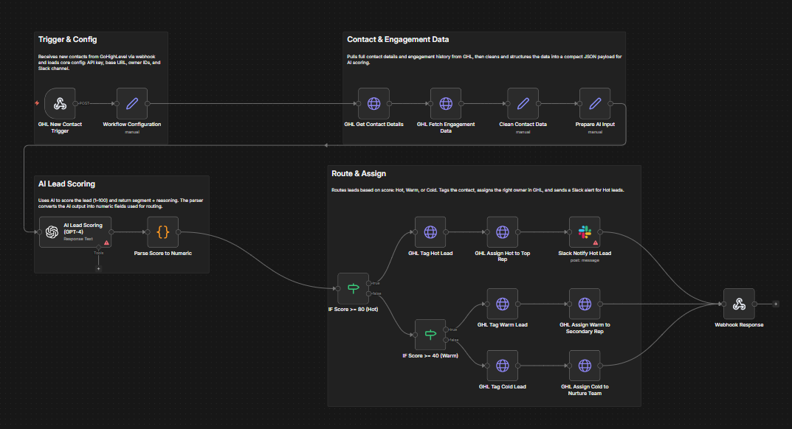

# Automation Portfolio — Mohamed - Automation Specialist

Automation Engineer specializing in workflow, integration, and AI automation.

## Projects

### AI EOD Reporting & Distribution Automation

Automated end-of-day (EOD) reporting workflow that aggregates task and opportunity data, generates structured AI summaries, and distributes reports across multiple channels.

**Key capabilities:**
- Scheduled trigger for automated daily execution
- Aggregates ClickUp tasks and GHL opportunities
- Data merging and transformation pipeline
- AI agent generates structured EOD summaries
- Multi-channel distribution (Slack, Email, Google Drive)
- Automated file conversion and cloud upload

**Tools & integrations:**  
n8n • Azure OpenAI • ClickUp • GoHighLevel (GHL) • Slack • Email • Google Drive  

**Outcome:**  
Eliminates manual reporting, ensures consistent daily updates, and delivers AI-generated insights automatically to stakeholders.

### Subscription Renewal Reminder & Tracking Automation

Automated workflow that monitors customer renewal dates, sends proactive reminders, alerts internal teams, and logs outcomes for tracking and reporting.

**Key capabilities:**
- Daily scheduled scan of GoHighLevel contacts
- Detects upcoming renewals within 10 days
- Filters contacts with renewal metadata
- Automated customer renewal email via Gmail
- Internal Slack alerts for team visibility
- Consolidates notification results
- Generates summary report
- Logs renewal activity to Google Sheets

**Outcome:**  
Prevents missed renewals, improves retention follow-ups, and provides a centralized renewal tracking log for operations teams.

### AI Lead Scoring & Automated Assignment Workflow

AI-powered lead qualification workflow that analyzes new CRM contacts, calculates engagement-based scores, and automatically assigns leads to the appropriate sales pipeline with notifications.

**Key capabilities:**
- Webhook trigger for new GoHighLevel contacts
- Retrieves contact and engagement history
- Data cleaning and AI input preparation
- GPT-based lead scoring model
- Converts AI score into numeric routing logic
- Segments leads into Hot, Warm, and Cold tiers
- Automatic tagging and owner assignment in CRM
- Slack alerts for high-priority (Hot) leads

**Scoring logic:**
- Score ≥ 80 → Hot lead → Assign to top sales rep + Slack alert  
- Score 40–79 → Warm lead → Assign to secondary rep  
- Score < 40 → Cold lead → Assign to nurture pipeline  

**Outcome:**  
Improves sales response time, prioritizes high-value prospects, and ensures consistent lead distribution without manual triage.

Tools
n8n • Zapier • APIs • Webhooks • Python • SQL

📩 Open to freelance & collaboration in automation
